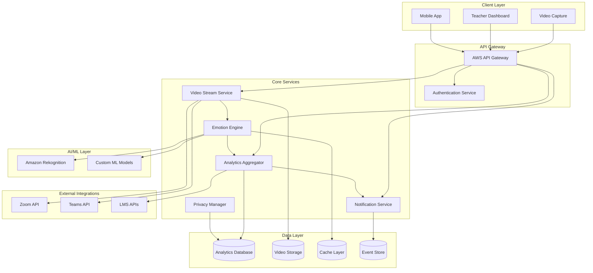

# Design Document: Vibelytics Emotion Analytics Platform

## Overview

Vibelytics is a cloud-native real-time emotion analytics platform built on AWS infrastructure that leverages Amazon Rekognition for facial expression analysis. The system processes live video feeds from educational environments, analyzes student emotions, and provides immediate feedback to educators through an intuitive dashboard interface.

The platform follows a microservices architecture with event-driven communication, ensuring scalability, reliability, and real-time performance. All components are designed with privacy-first principles, implementing comprehensive data protection measures and regulatory compliance.

## Architecture

### High-Level Architecture



### Component Architecture

The system is composed of six primary microservices:

1. **Video Stream Service**: Handles video ingestion, preprocessing, and routing
2. **Emotion Engine**: Core emotion analysis using Amazon Rekognition and custom models
3. **Analytics Aggregator**: Processes emotion data into engagement metrics and insights
4. **Notification Service**: Manages real-time alerts and teacher notifications
5. **Privacy Manager**: Ensures data protection, consent management, and compliance
6. **Authentication Service**: Handles user authentication and authorization

## Components and Interfaces

### Video Stream Service

**Responsibilities:**
- Ingest video feeds from multiple sources (webcams, mobile devices, video conferencing)
- Preprocess video streams for optimal emotion analysis
- Route video frames to the Emotion Engine
- Manage video quality adaptation based on network conditions

**Key Interfaces:**
```typescript
interface VideoStreamService {
  ingestStream(source: VideoSource, metadata: StreamMetadata): StreamId
  preprocessFrame(frame: VideoFrame): ProcessedFrame
  routeToAnalysis(streamId: StreamId, frame: ProcessedFrame): void
  adaptQuality(streamId: StreamId, networkConditions: NetworkMetrics): void
}

interface VideoSource {
  type: 'webcam' | 'mobile' | 'conference' | 'classroom_camera'
  url: string
  credentials?: AuthCredentials
  quality: VideoQuality
}
```

**Integration Points:**
- Amazon Kinesis Video Streams for scalable video ingestion
- AWS Lambda for serverless video preprocessing
- WebRTC for real-time video streaming from browsers

### Emotion Engine

**Responsibilities:**
- Analyze facial expressions using Amazon Rekognition
- Apply custom ML models for education-specific emotion classification
- Generate individual and aggregate emotion scores
- Handle multiple faces in single frames

**Key Interfaces:**
```typescript
interface EmotionEngine {
  analyzeFrame(frame: ProcessedFrame): EmotionAnalysis
  detectFaces(frame: ProcessedFrame): Face[]
  classifyEmotions(faces: Face[]): EmotionScore[]
  aggregateClassEmotions(scores: EmotionScore[]): ClassEngagement
}

interface EmotionAnalysis {
  timestamp: Date
  faces: FaceEmotion[]
  classEngagement: EngagementScore
  confidence: number
}

interface FaceEmotion {
  faceId: string
  emotions: {
    engaged: number
    confused: number
    bored: number
    frustrated: number
    happy: number
    neutral: number
  }
  confidence: number
}
```

**Amazon Rekognition Integration:**
- Uses DetectFaces API for face detection and bounding boxes
- Leverages DetectModerationLabels for content filtering
- Implements custom emotion classification on top of Rekognition's emotion detection
- Processes up to 15 faces per frame with sub-second response times

### Analytics Aggregator

**Responsibilities:**
- Process real-time emotion data into engagement metrics
- Generate historical analytics and trends
- Create teacher insights and recommendations
- Manage data aggregation for privacy compliance

**Key Interfaces:**
```typescript
interface AnalyticsAggregator {
  processEmotionData(analysis: EmotionAnalysis): EngagementMetrics
  generateClassInsights(classId: string, timeRange: TimeRange): ClassInsights
  createTeacherReport(teacherId: string, period: ReportPeriod): TeacherReport
  aggregateForPrivacy(rawData: EmotionData[]): AggregatedData
}

interface EngagementMetrics {
  overallScore: number
  emotionDistribution: EmotionDistribution
  trends: EngagementTrend[]
  alerts: Alert[]
}
```

### Notification Service

**Responsibilities:**
- Generate real-time alerts based on engagement thresholds
- Deliver notifications through multiple channels
- Manage alert preferences and customization
- Track teacher response to alerts

**Key Interfaces:**
```typescript
interface NotificationService {
  evaluateAlerts(metrics: EngagementMetrics): Alert[]
  sendNotification(alert: Alert, preferences: NotificationPreferences): void
  trackResponse(alertId: string, response: TeacherResponse): void
  customizeThresholds(teacherId: string, thresholds: AlertThresholds): void
}

interface Alert {
  id: string
  type: 'low_engagement' | 'individual_concern' | 'technical_issue'
  severity: 'low' | 'medium' | 'high'
  message: string
  actionable: boolean
  timestamp: Date
}
```

### Privacy Manager

**Responsibilities:**
- Manage student consent and data permissions
- Implement data encryption and secure storage
- Handle data deletion requests
- Ensure regulatory compliance (FERPA, COPPA, GDPR)

**Key Interfaces:**
```typescript
interface PrivacyManager {
  obtainConsent(studentId: string, permissions: DataPermissions): ConsentRecord
  encryptData(data: SensitiveData): EncryptedData
  anonymizeData(data: PersonalData): AnonymizedData
  handleDeletionRequest(request: DeletionRequest): DeletionResult
  auditDataAccess(operation: DataOperation): AuditLog
}

interface DataPermissions {
  faceAnalysis: boolean
  dataRetention: RetentionPeriod
  researchParticipation: boolean
  parentalConsent: boolean
}
```

## Data Models

### Core Data Structures

```typescript
// Student and Class Management
interface Student {
  id: string
  anonymizedId: string  // Used for analytics
  consentStatus: ConsentStatus
  permissions: DataPermissions
  enrolledClasses: string[]
}

interface Class {
  id: string
  teacherId: string
  name: string
  schedule: ClassSchedule
  students: string[]
  settings: ClassSettings
}

// Emotion and Engagement Data
interface EmotionSnapshot {
  timestamp: Date
  classId: string
  anonymizedStudentId: string
  emotions: EmotionScores
  engagementLevel: number
  confidence: number
}

interface EngagementSession {
  id: string
  classId: string
  startTime: Date
  endTime: Date
  overallEngagement: number
  emotionSummary: EmotionSummary
  alerts: Alert[]
  teacherActions: TeacherAction[]
}

// Analytics and Reporting
interface ClassInsights {
  classId: string
  period: TimeRange
  averageEngagement: number
  emotionTrends: EmotionTrend[]
  peakEngagementTimes: TimeSlot[]
  recommendations: Recommendation[]
}

interface TeacherReport {
  teacherId: string
  period: ReportPeriod
  classesAnalyzed: number
  averageEngagement: number
  improvementAreas: string[]
  successMetrics: SuccessMetric[]
}
```

### Database Schema

**Analytics Database (PostgreSQL on AWS RDS):**
- `classes` - Class information and settings
- `engagement_sessions` - Session-level engagement data
- `emotion_snapshots` - Individual emotion measurements (anonymized)
- `teacher_insights` - Aggregated analytics for teachers
- `alert_history` - Historical alert data and responses
- `consent_records` - Student consent and permission tracking

**Cache Layer (Redis on AWS ElastiCache):**
- Real-time engagement scores (TTL: 1 hour)
- Active session data (TTL: 24 hours)
- Frequently accessed teacher preferences (TTL: 7 days)

## Correctness Properties

*A property is a characteristic or behavior that should hold true across all valid executions of a system—essentially, a formal statement about what the system should do. Properties serve as the bridge between human-readable specifications and machine-verifiable correctness guarantees.*

Before defining the correctness properties, I need to analyze the acceptance criteria from the requirements to determine which ones are testable as properties.

### Core Correctness Properties

Based on the prework analysis and property reflection, here are the key correctness properties that validate the system's behavior:

**Property 1: Real-time emotion analysis performance**
*For any* valid video frame input, the Emotion_Engine should complete facial expression analysis and return emotion classifications within 2 seconds
**Validates: Requirements 1.1, 1.3**

**Property 2: Emotion classification completeness**
*For any* detected face in a video frame, the emotion classification should include all required categories (engaged, confused, bored, frustrated, happy, neutral) with confidence scores
**Validates: Requirements 1.2**

**Property 3: Multi-face analysis independence**
*For any* video frame containing multiple faces, each face should receive independent emotion analysis with separate scores
**Validates: Requirements 1.4**

**Property 4: Graceful error handling**
*For any* video input with insufficient quality or processing errors, the system should log the issue and continue processing without throwing exceptions
**Validates: Requirements 1.5, 6.4**

**Property 5: Engagement alert generation**
*For any* class session where engagement metrics fall below configured thresholds, appropriate alerts should be generated within the specified time limits
**Validates: Requirements 2.1, 2.2**

**Property 6: Alert notification delivery**
*For any* generated alert, the Teacher_Dashboard should display the notification and track teacher responses
**Validates: Requirements 2.3, 2.4**

**Property 7: Cross-environment consistency**
*For any* identical video content processed in different environments (online vs offline), emotion detection accuracy should remain within acceptable variance
**Validates: Requirements 3.3**

**Property 8: Network resilience**
*For any* network connectivity issues, the system should queue data for later processing without data loss
**Validates: Requirements 3.4**

**Property 9: Consent enforcement**
*For any* student joining a monitored session, facial data processing should only begin after explicit consent is obtained and recorded
**Validates: Requirements 4.1**

**Property 10: Data encryption compliance**
*For any* student data being processed or stored, encryption should be applied both in transit and at rest
**Validates: Requirements 4.2**

**Property 11: Data retention policy enforcement**
*For any* analytics data storage operation, only aggregated emotion scores should be retained while raw video and facial recognition data should be discarded
**Validates: Requirements 4.3**

**Property 12: Data deletion compliance**
*For any* valid data deletion request, all associated student data should be removed within the specified timeframe
**Validates: Requirements 4.4**

**Property 13: Audit trail completeness**
*For any* data access or processing operation, comprehensive audit logs should be created and maintained
**Validates: Requirements 4.6**

**Property 14: Dashboard data accuracy**
*For any* class session data, the Teacher_Dashboard should display accurate engagement scores, trends, and analytics that match the underlying data
**Validates: Requirements 5.1, 5.2, 5.3**

**Property 15: Report generation integrity**
*For any* class data, generated reports should contain complete engagement patterns and metrics without data corruption
**Validates: Requirements 5.4**

**Property 16: Concurrent processing performance**
*For any* number of simultaneous video feeds up to system capacity, processing times should remain within acceptable limits
**Validates: Requirements 6.1, 6.2**

**Property 17: Adaptive quality management**
*For any* network bandwidth constraints, the system should automatically adjust video processing quality to maintain functionality
**Validates: Requirements 6.3**

**Property 18: Data export format compliance**
*For any* data export operation, the output should be in the specified format (CSV/JSON) and compatible with standard analytics tools
**Validates: Requirements 7.3**

**Property 19: Privacy-preserving analytics**
*For any* analytics report or research data export, no personally identifiable information should be present while preserving analytical value
**Validates: Requirements 8.1, 8.3**

**Property 20: Query capability completeness**
*For any* valid query parameters (time, subject, teaching method), the analytics database should return appropriate engagement pattern data
**Validates: Requirements 8.2**

**Property 21: Statistical analysis accuracy**
*For any* comparable teaching method datasets, statistical analysis should provide mathematically correct engagement difference calculations
**Validates: Requirements 8.4**

## Error Handling

### Error Categories and Responses

**Video Processing Errors:**
- Invalid video format: Log error, request format conversion, continue with other streams
- Network timeout: Implement exponential backoff, queue frames for retry
- Face detection failure: Log incident, continue processing, notify teacher of reduced accuracy

**Amazon Rekognition Errors:**
- API rate limiting: Implement intelligent throttling and request queuing
- Service unavailable: Fallback to cached emotion models, graceful degradation
- Quota exceeded: Alert administrators, implement usage monitoring

**Data Privacy Errors:**
- Consent not obtained: Block processing, prompt for consent, maintain audit trail
- Encryption failure: Halt data processing, alert security team, investigate
- Unauthorized access: Log security incident, revoke access, notify administrators

**System Performance Errors:**
- Memory exhaustion: Implement circuit breakers, scale resources, alert operations
- Database connection failure: Use connection pooling, implement retries, fallback to cache
- Cache unavailable: Continue with direct database access, monitor performance impact

### Error Recovery Strategies

**Automatic Recovery:**
- Retry failed operations with exponential backoff
- Failover to backup services and regions
- Auto-scaling based on error rates and system load

**Manual Intervention:**
- Alert administrators for critical system failures
- Provide diagnostic information for troubleshooting
- Implement maintenance mode for system updates

## Testing Strategy

### Dual Testing Approach

The Vibelytics platform requires both unit testing and property-based testing to ensure comprehensive coverage and correctness validation.

**Unit Testing Focus:**
- Specific integration points with Amazon Rekognition API
- Edge cases in emotion classification algorithms
- Error handling scenarios with malformed data
- Authentication and authorization workflows
- Database transaction integrity
- UI component behavior with specific data sets

**Property-Based Testing Focus:**
- Universal properties that hold across all valid inputs
- Emotion analysis consistency across different video qualities
- Performance characteristics under varying loads
- Data privacy and encryption compliance
- Alert generation accuracy across different engagement patterns
- Cross-platform compatibility validation

**Testing Configuration:**
- Property-based tests: Minimum 100 iterations per test using Hypothesis (Python) or fast-check (TypeScript)
- Each property test tagged with: **Feature: vibelytics-emotion-analytics, Property {number}: {property_text}**
- Unit tests: Focus on specific examples and integration points
- Integration tests: End-to-end workflows with real AWS services in test environment

**Test Data Management:**
- Synthetic video generation for consistent testing
- Anonymized real classroom data for validation (with proper consent)
- Mock Amazon Rekognition responses for unit testing
- Performance benchmarking datasets for load testing

**Continuous Testing:**
- Automated testing pipeline with every code change
- Performance regression testing with baseline metrics
- Security testing for data privacy compliance
- Cross-browser and mobile device testing for dashboard functionality

The combination of unit and property-based testing ensures that specific integration points work correctly while universal system properties hold across all possible inputs and scenarios.